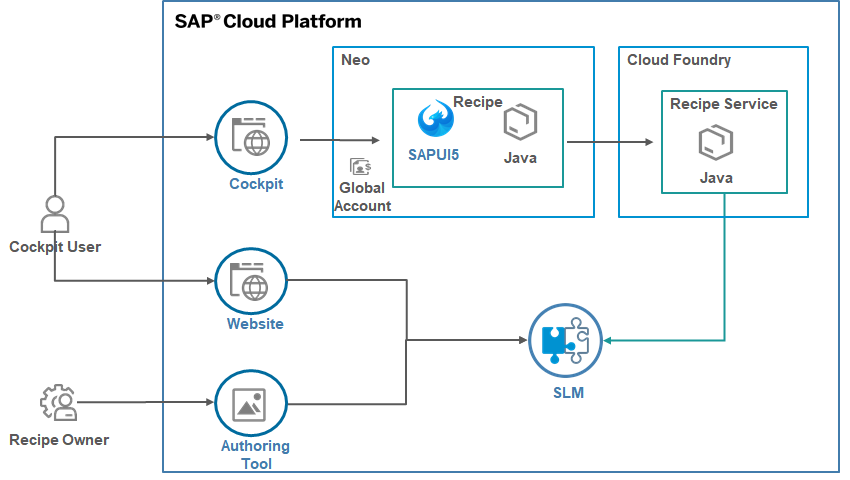
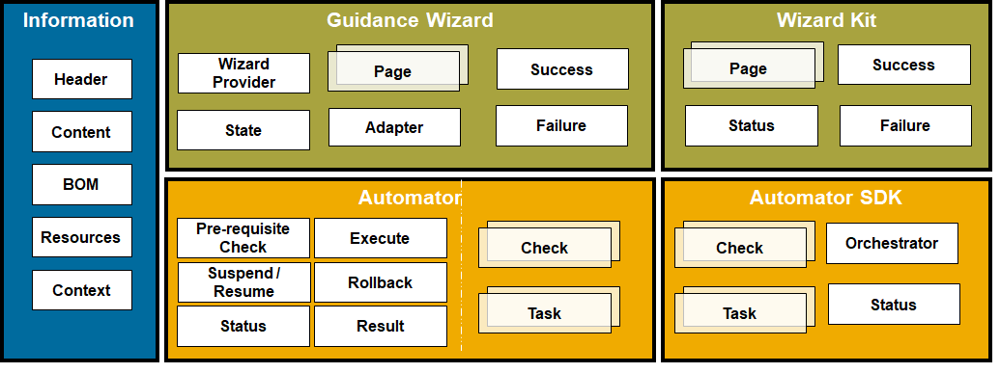

# OVERVIEW

## **Components**

- **Recipe** : This is a SAP Cloud Platform cockpit based module acting as user experience layer for recipe. This consists of different reusable utilities for recipe implementors.
- **Recipe Service** : This is a Cloud Foundry backend service supporting the backend operations for recipe. This is still **not productive**.
- **SLM** : This is the SAP Cloud Platform market place service which stores the recipe contents.
- **Authoring Tool** : Tool for recipe authors to document the recipe

## **Building Blocks**
