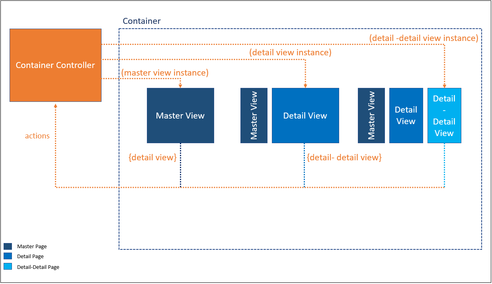
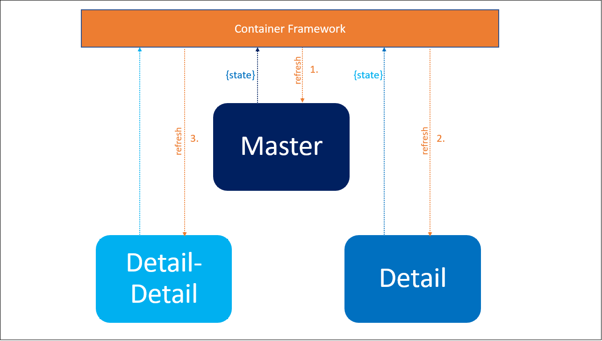

# Flexible Layout Container

## Overview
There are some functionalities that the framework already takes care of. Lets take a look at them. Any view placed inside this container gets these methods in its `viewData` already.




You can access them using the following commands any where in the controller of your view.

``` javascript
this.parentObject = this.getView().getViewData().getParentObject();
// for view Details from Provider
var oViewDetails = this.parentObject.viewDetails;
// for getting state helper instance
var oStateHelper = this.parentObject.getStateHelper();
// for performing container supported operations
var fContainerOperation = this.parentObject.containerOperation;
```
!!! note ""
    More details on each are below.

## Container Supported Operations

A method is put in place which takes in a object and performs actions based on the input. The parameters are as follows:

``` javascript
this.parentObject = this.getView().getViewData().getParentObject();
this.parentObject.containerOperation({
                    source: "",
					destination: "",
					target: "",
					performAction: action,
					performActionWith: aParams
				});
```
* __`source`__: Current page from where the action is triggered,

	ex: '_master_', '_detail_', '_detail-detail_'.

* __`destination`__: The page which is the recipient of the action.

  	ex: '_master_', '_detail_', '_detail-detail_', '_container_'.

* __`target`__: The segment being targeted for the action.

	ex: '_layout_', '_view_', '_closeButton_'.

* __`performAction`__: The action to be performed.

	ex: '_update_', '_attachEventHandler_', '_change_', '_refresh_', '_setBusy_'.

* __`performActionWith`__: The parameters if any required for the action to be performed.

### Navigation

The navigation flow of the Master-Detail app considers the Master, Detail and Detail-Detail pages, and has been eased for implementation by providing a set of navigation routes.

For example if you wish to navigate to the Detail View from Master use the following snippet.

``` javascript
this.parentObject = this.getView().getViewData().getParentObject();
this.parentObject.containerOperation({
					source: "master",
					destination: "detail",
					target: "view",
					performAction: "update",
					performActionWith: ["<path_to_details_view>", <custom_data>]
				});
```


### Column Actions

The framework takes care of basic actions like `expand`, `collapse` and `close` of all three pages on its own. Over and above this you can attach your own action handlers to any of these buttons. For example if you wish to remove selection from master page when details is closed then use the following snippet.

``` javascript
this.parentObject = this.getView().getViewData().getParentObject();
this.parentObject.containerOperation({
					source: "master",
					destination: "detail",
					target: "closeButton",
					performAction: "attachEventHandler",
					performActionWith: [function(){
						// custom action handler
						//do something
					}]
				});
```

### Busy Indication

You can use a the following snippet to set the `container`, `master`, `detail`, `detail-detail` page busy.

``` javascript
this.parentObject = this.getView().getViewData().getParentObject();
this.parentObject.containerOperation({
					destination: "detail",// or "container", "master", "detailDetail"
					target: "view",
					performAction: "setBusy"
				});
```

### Content Refresh

The flow of refresh is controlled by the framework.



The refresh of page content is triggered in two ways.

#### On Load

Every time a page is accessed the content of each open page is refreshed in a chained way as controlled by the framework. This also checks for the validity of the page that is open.

#### On Demand

Any of the pages can also refresh the content of any page that is open by using the following snippet.

``` javascript
this.parentObject = this.getView().getViewData().getParentObject();
this.parentObject.containerOperation({
					destination: "master",// or "container", "detail", "detailDetail"
					target: "view",
					performAction: "refresh",
					performActionWith: [<custom_data>]
				});
```

### State Management

The framework facilitates state management of views through which you can retain state of a particular page once opened. For instance if you have searched a particular text in a `detail` page or have expanded a particular panel then that state remains even after you switch between views or change selections.

!!! warning ""
	- State persistence makes the maintenance of the view tougher and the code becomes more prone to issues. Hence the use of this feature should be avoided as much possible.
	- The whole logic is implemented assuming to be supplied unique ids across pages whose state is maintained.


``` javascript

this.parentObject = this.getView().getViewData().getParentObject();

// update master selection with id
this.parentObject.getStateHelper().updateMasterSelection("<id>");

// get current selected master
this.parentObject.getStateHelper().getCurrentMasterSelection();

// update detail selection state
this.parentObject.getStateHelper().updateCurrentSelectedDetailsUIState({
					id: "<id>",
					<property>: "<value>"
				});

// get detail selection state
this.parentObject.getStateHelper().getCurrentSelectedDetailsUIState();
```