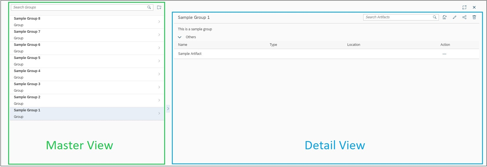

# Implementing a Master-Detail Page

## Overview

The Recipe Wizard extends support to Master-Detail pages by taking care of the commonly used functionalities and abstracting it to a `FlexibleColumnLayoutContainer.controller.js` which acts as a base controller to all implementing controllers.

The Wizard Master-Detail template implements a flexible column layout, one of the design patterns that is specified by the SAP Fiori design guidelines . The flexible column layout offers different layouts with up to three columns. For more information about flexible columns and its usage, see the <a href="https://experience.sap.com/fiori-design-web/flexible-column-layout/" target="_blank">SAP Fiori Design</a>

&nbsp;


## Creating Views for Flex Layout

For the extension framework to pickup your views for your Master Detail Page you will be required to configure a provider list accordingly.

!!! note ""
    The steps for creating a flex based page for the wizard are explained [here](../implementing-wizard-flex-view).

### Configuring your Page

You can find the `FlexibleColumnLayoutProviders.js` in following directory:
```text
 ── cockpit-module-recipe
    └── src
        └── main
            └── js
                └── cockpit
                    └── recipe
                        └── core
                            └── common
                                └── flexiblecolumnlayout
```
You will need to add an entry in the `viewMap` Object as:

```json
<unique_key>: {
			id: "<flex_view_id>",
			defaultFlexibleColumnMode: "<mode>",
			MASTER: {
				defaultView: "<view_path1>",
				views: []
			},
			DETAIL: {
				defaultView: null,
				views: ["<view_path2>","<view_path3>"],
				injectionMode: "<injection_mode>"
			},
			DETAIL_DETAIL: {
				defaultView: null,
				views: []
			}
		}
```

* **`unique_key`** : This key will be used to fetch the meta data from the providers list.

* **`flex_view_id`** : Specifies a unique id for your section.
                    _Could be same as the key_

* **`mode`** : Specifies the mode in which the Page should open on first load. Possible values are:

    * *MASTER*
    * *MASTER_DETAIL*
    * *MASTER_DETAIL_DETAIL*

* **`view_path1`** : Corresponds to an XML module that can be loaded via the module system (viewName + suffix ".view.xml"). Example- `cockpit.recipe.explore.YourViewName`.

    It is being set as the __default view__ of the Master page so the framework shall load this view whenever the page is accessed.

* **`view_path2`, `view_path3`** : Corresponds to an XML modules that can be loaded via the module system (viewName + suffix ".view.xml"). Example- `cockpit.recipe.explore.YourViewName`.

    These views are being sent to the framework as a part of the registry process and the same can be retrieved from the `viewData`. If a __default view__ would be provided then that takes priority over the mode and will be set for the Detail page even if the mode is *Master*.

* **`injection_mode`** : Specifies the mode in which a page is injected in container and how is it updated. Possible values are:

    * *INJECT_UPDATE* : This mode enables a frame-work level cache of views once injected / created and the same instance is updated every time the page is accessed. This is helpful if the state of view is to be controlled explicitly.
    * *INJECT_ALWAYS* : This mode is used when you wish to create a new instance of the view each time it is accessed. This can be helpful if view is supposed to be stateless.

    *This property is only supported by the Detail and Detail_Detail pages as the mode for master is assumed to be `INJECT_UPDATE` by default.*

## Consumption

### Implementing a Flex Page

To implement a page you can first [configure your views](../own-masterdetail/implement-a-flex-view.md#configuring-your-page) and then simply <a href="https://sapui5.hana.ondemand.com/#/api/sap.ui.core.mvc.XMLView/methods/sap.ui.core.mvc.XMLView.create" target="_blank">create a View</a> using the following object.

```json
{
	viewName: "cockpit.recipe.core.common.flexiblecolumnlayout.FlexibleColumnLayoutContainer",
    viewData: {
        viewDetails: <configuration_entry>
    }
}
```
!!! note ""
    Here `configuration_entry` is your configuration from the `FlexibleColumnLayoutProviders.js` and can be retrieved by `FlexibleColumnLayoutProviders.getViewDetails(unique_key)`

For more information on framework head to the [Flex Container](../concept/flex-container-framework) segment.